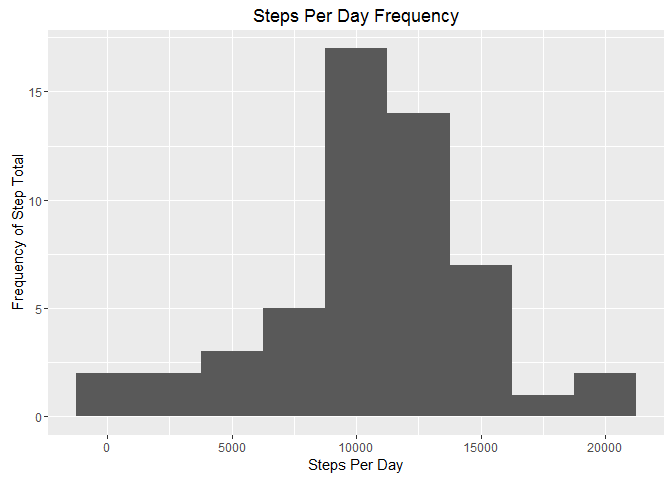
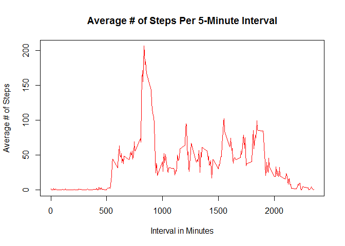
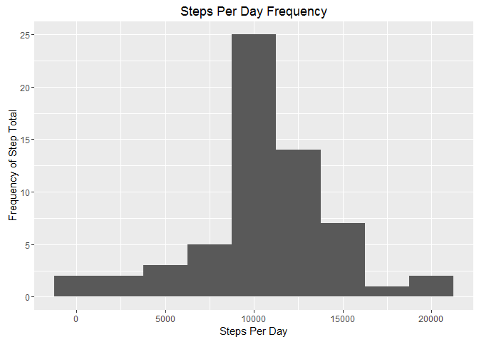
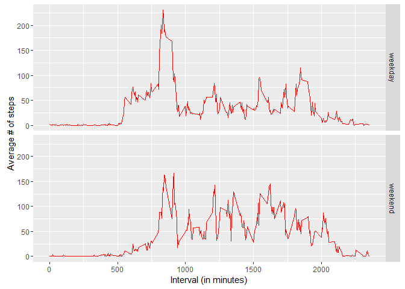

# Reproducible Research: Peer Assessment 1

## Required Libraries

```r
library(dplyr)
library(ggplot2)
```

## Loading and preprocessing the data
First, read the data from the same directory as the R Markdown file.  
The data is in the file named, *activity.csv*.


```r
rawdata.filename <- "activity.csv"
rawdata <- read.csv(rawdata.filename)
rawdata$date2 <- as.Date(rawdata$date)
```
**Total number of observations:** 17568  
**The max number of steps in the data is:** 806  
**The min number of steps in the data is:** 0  
**The mean number of steps in the data is:** 37.3825996  
*There are 2304 NA steps values.*


## What is mean total number of steps taken per day?

*NOTE: There are 8 days that had no steps data, so those days are ignored from the aggregation of results.*  

### Data Aggregation and Calculations

```r
steps.per.day <- aggregate(steps ~ date2, rawdata, FUN=sum, na.rm=TRUE)
head(steps.per.day)
```

```
##        date2 steps
## 1 2012-10-02   126
## 2 2012-10-03 11352
## 3 2012-10-04 12116
## 4 2012-10-05 13294
## 5 2012-10-06 15420
## 6 2012-10-07 11015
```

```r
nrow(steps.per.day)
```

```
## [1] 53
```

```r
mean.steps.per.day <- mean(steps.per.day$steps, na.rm = TRUE)
median.steps.per.day <- median(steps.per.day$steps, na.rm=TRUE)
```

### 1. Histogram of Total Number of Steps Each Day

```r
qplot(steps.per.day$steps, binwidth=2500,
      xlab="Steps Per Day",
      ylab="Frequency of Step Total",
      main="Steps Per Day Frequency")
```

 

### 2. Actual Mean & Median Values
**The average number of steps per day is:** 10766  
**The median number of steps per day is:** 10765  

## What is the average daily activity pattern?
Using the data, show:
1. A time series plot representing the average number of steps per interval within a day.
1. The interval with the maximum number of steps, on average.

**NOTE: All aggregations and days with no valid measurements are removed.**


```r
mean.steps.per.interval <- aggregate(steps ~ interval, rawdata, FUN=mean, na.rm=TRUE)
head(mean.steps.per.interval)
```

```
##   interval     steps
## 1        0 1.7169811
## 2        5 0.3396226
## 3       10 0.1320755
## 4       15 0.1509434
## 5       20 0.0754717
## 6       25 2.0943396
```

### Time Series Plot (Avg Steps per Interval)


```r
plot(mean.steps.per.interval$interval, mean.steps.per.interval$steps,
     type="l", col="red", lwd=1,
     xlab="Interval in Minutes",
     ylab="Average # of Steps",
     main="Average # of Steps Per 5-Minute Interval")
```

 

### Time Interval w/ Maximum Steps on Average

```r
max.interval <- mean.steps.per.interval[which.max(mean.steps.per.interval$steps),]
max.interval
```

```
##     interval    steps
## 104      835 206.1698
```
The 5-minute interval with the maximum number of steps, on average is interval **835**,
which as an average number of steps of **206**.

## Imputing missing values

### 1. Number of Rows with Missing Values


```r
missing.values <- sum(is.na(rawdata$steps))
```
There are **2304** rows with missing *steps* measurements.

### 2. Filling in Missing Values
The strategy used here for filling in the missing values is to replace *NA* values with the mean number of steps for that particular time interval across the dataset.

### 3. Create Imputed Dataset
Use a left join to create a temporary column that includes the mean step value for that particular interval.  Using a mutation, add a column that uses the mean value only if the raw *steps* value is *NA*.


```r
rawdata.imputed <- left_join(rawdata, mean.steps.per.interval, by="interval") %>%
    mutate(steps.imputed = ifelse(is.na(steps.x), steps.y, steps.x)) %>%
    select(date = date2, interval, steps = steps.imputed)
head(rawdata.imputed)
```

```
##         date interval     steps
## 1 2012-10-01        0 1.7169811
## 2 2012-10-01        5 0.3396226
## 3 2012-10-01       10 0.1320755
## 4 2012-10-01       15 0.1509434
## 5 2012-10-01       20 0.0754717
## 6 2012-10-01       25 2.0943396
```

### 4. Create Histogram and Compute Mean/Median of Imputed Dataset

```r
new.steps.per.day <- aggregate(steps ~ date, rawdata.imputed, FUN=sum, na.rm=TRUE)
head(new.steps.per.day)
```

```
##         date    steps
## 1 2012-10-01 10766.19
## 2 2012-10-02   126.00
## 3 2012-10-03 11352.00
## 4 2012-10-04 12116.00
## 5 2012-10-05 13294.00
## 6 2012-10-06 15420.00
```

```r
nrow(new.steps.per.day)
```

```
## [1] 61
```

```r
new.mean.steps.per.day <- mean(new.steps.per.day$steps, na.rm = TRUE)
new.median.steps.per.day <- median(new.steps.per.day$steps, na.rm=TRUE)
```

#### New Histogram of Total Number of Steps Each Day

```r
qplot(new.steps.per.day$steps, binwidth=2500,
      xlab="Steps Per Day",
      ylab="Frequency of Step Total",
      main="Steps Per Day Frequency")
```

 

#### New Mean & Median Values
As you can see below, the value for the median went up by one step, but the mean did not change after imputing the *NA* steps values.

- Old Values  
-- Mean: 10766  
-- Median: 10765  
- New values  
-- Mean: 10766  
-- Median: 10766  

##### What impact does this have on the total daily steps?  
There are more days within some of the various bins on the steps per day histogram.  This shows that there are more data that will be counted that was not previously counted, which is also indicated by the slight rise in median.

## Are there differences in activity patterns between weekdays and weekends?

### Add *day.type* Column Indicating Weekday/Weekend
Calculate whether a date falls on a weekend or not.  Create a column, *day.type* that holds "weekend" if the day falls on a Saturday or Sunday, otherwise the *day.type* is a "weekday".  

```r
rawdata.imputed$weekday <- weekdays(rawdata.imputed$date)
rawdata.imputed <- rawdata.imputed %>% 
    mutate(day.type = ifelse(weekday %in% c("Saturday", "Sunday"), "weekend", "weekday")) %>%
    select(-weekday)
head(rawdata.imputed)
```

```
##         date interval     steps day.type
## 1 2012-10-01        0 1.7169811  weekday
## 2 2012-10-01        5 0.3396226  weekday
## 3 2012-10-01       10 0.1320755  weekday
## 4 2012-10-01       15 0.1509434  weekday
## 5 2012-10-01       20 0.0754717  weekday
## 6 2012-10-01       25 2.0943396  weekday
```

### Time Series of Steps on Weekdays vs. Weekends
Calculate the new average steps per interval on weekends vs. weekdays and plot them as a time series.


```r
final.mean.steps.per.interval <- aggregate(steps ~ interval + day.type, rawdata.imputed, FUN=mean, na.rm=TRUE)
ggplot(final.mean.steps.per.interval, aes(interval, steps)) + 
    geom_line(col="red") + 
    facet_grid(day.type ~ .) +
    xlab("Interval (in minutes)") + ylab("Average # of steps")
```

 

